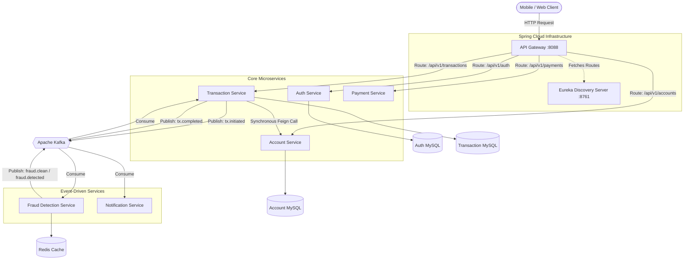

<h1 align="center">🏦 Distributed Banking System (Microservices)</h1>

<div align="center">
  
  
  
  
  
  
</div>

<br/>

A highly scalable, production-grade core banking platform built using a **Microservices Architecture**. This project is designed to handle distributed transactions, high-concurrency balance updates, real-time fraud detection, and asynchronous event-driven communication.

It showcases advanced distributed system design patterns designed to prevent data loss, ensure financial consistency, and maintain high availability.

---

## 🏗️ System Architecture

The architecture utilizes an API Gateway for centralized routing and security, synchronous inter-service communication via OpenFeign, and asynchronous event-driven choreography via Apache Kafka.



---

## 🧩 Microservices Breakdown

1. **API Gateway Service (`api-gateway-service`)**: 
   The single entry point into the system. Implements **Gateway-Offloading Security** by validating JWTs, enforcing Role-Based Access Control (RBAC), and applying Redis-backed rate limiting. It forwards the `X-User-Email` and `X-User-Role` headers to downstream services.
2. **Service Registry (`registry-service`)**: 
   Netflix Eureka server for dynamic service discovery, allowing microservices to locate each other without hardcoded IPs.
3. **Auth Service (`auth-service`)**: 
   Handles user onboarding, secure BCrypt password hashing, and issues JSON Web Tokens (JWT) containing user roles.
4. **Account Service (`account-service`)**: 
   Manages user bank accounts. Ensures atomic balance updates and enforces data ownership (users can only view their own accounts unless they are an ADMIN).
5. **Transaction Service (`transaction-service`)**: 
   The core orchestration engine. Manages P2P transfers, OTP verification, and drives the distributed Saga workflow. Contains a Sweeper Job to recover crashed transactions.
6. **Fraud Detection Service (`fraud-detection-service`)**: 
   Inspects transactions in real-time. Uses Redis to track transaction velocity (rate of transfers) and flags statistically suspicious amounts based on user history.
7. **Payment Service (`payment-service`)**: 
   Integrates with external payment gateways (e.g., Razorpay) to allow users to add funds to their wallets/accounts.
8. **Notification Service (`notification-service`)**: 
   A purely event-driven consumer that listens to Kafka topics to send asynchronous email/SMS receipts to users upon transaction completion.

---

## 🚀 Enterprise Distributed Patterns Implemented

This project solves several complex challenges inherent to distributed financial systems:

### 1. Concurrency Control (Pessimistic Locking)
**The Problem**: If two transfers deduct money from the same account at the exact same millisecond, the "Lost Update" anomaly occurs, effectively creating free money.
**The Solution**: Implemented Database-Level Pessimistic Locking (`@Lock(LockModeType.PESSIMISTIC_WRITE)` / `SELECT ... FOR UPDATE`). The database forces concurrent requests on the same account to queue up, guaranteeing mathematically perfect balance deductions.

### 2. Transactional Outbox Pattern
**The Problem**: The "Dual-Write" problem. If a service saves a transaction to MySQL and then publishes an event to Kafka, a Kafka crash right after the DB commit results in permanent event loss.
**The Solution**: Events are saved to an `outbox_events` table within the *same local database transaction* as the business data. A separate `@Scheduled` publisher polls this table and relays events to Kafka, guaranteeing **at-least-once delivery** and extreme resilience.

### 3. Saga Pattern (Choreography)
Distributed transactions that span multiple databases are managed using the Saga pattern. 
- *Step 1*: Transaction Service deducts balance locally and publishes `transaction.initiated`.
- *Step 2*: Fraud Service consumes the event, checks for fraud, and publishes a result.
- *Step 3*: If fraud is detected, Transaction Service catches the event and triggers a compensating transaction (via Feign) to refund the Account Service.

### 4. Idempotency
Financial endpoints (like `/deduct` and `/credit`) are idempotent. If a network timeout causes the Transaction Service to retry a Feign request, the Account Service checks the `idempotencyKey` against a `processed_events` table and safely ignores duplicate deductions.

### 5. Sweeper Job (Self-Healing)
If a microservice container crashes in the middle of a transfer (e.g., after deducting funds but before publishing the next event), a background `TransactionSweeperJob` automatically detects stale `PENDING` transactions after 5 minutes and executes a rollback, ensuring eventual consistency.

---

## 🛠️ Technology Stack

* **Language**: Java 17
* **Framework**: Spring Boot 3.2.0, Spring Cloud 2023.0.0
* **Databases**: MySQL 8.0 (Data Persistence)
* **Cache & Rate Limiting**: Redis
* **Message Broker**: Apache Kafka & Zookeeper (Confluent CP 7.4.0)
* **Security**: Spring Security, JWT, BCrypt
* **Containerization**: Docker, Docker Compose

---

## 🐳 Getting Started

### Prerequisites
* Docker & Docker Compose installed
* Ports `8088`, `8761`, `3306`, `6379`, `9092` available

### Installation & Run

1. **Clone the repository**
   ```bash
   git clone https://github.com/yourusername/Banking-system.git
   cd Banking-system
   ```

2. **Build and start the infrastructure via Docker Compose**
   This will spin up MySQL, Redis, Kafka, Zookeeper, and all 8 microservices.
   ```bash
   docker-compose up -d --build
   ```

3. **Verify Deployment**
   Open your browser and navigate to the Eureka Dashboard to ensure all services are registered:
   `http://localhost:8761`

---

## 📖 API Walkthrough & Testing

All API requests must be routed through the API Gateway on **Port 8088**.

### 1. Register a new user
```bash
curl -X POST http://localhost:8088/api/v1/auth/register \
  -H "Content-Type: application/json" \
  -d '{"email":"john.doe@bank.com", "password":"securePassword123"}'
```

### 2. Login & Get JWT Token
```bash
curl -X POST http://localhost:8088/api/v1/auth/login \
  -H "Content-Type: application/json" \
  -d '{"email":"john.doe@bank.com", "password":"securePassword123"}'
```
*(Copy the `token` from the response for the next steps)*

### 3. Create a Bank Account
```bash
curl -X POST http://localhost:8088/api/v1/accounts \
  -H "Authorization: Bearer <YOUR_TOKEN>" \
  -H "Content-Type: application/json" \
  -d '{"email":"john.doe@bank.com", "accountType":"SAVING", "initialBalance": 1000.00}'
```

### 4. Initiate a Transfer
```bash
curl -X POST http://localhost:8088/api/v1/transactions/transfer \
  -H "Authorization: Bearer <YOUR_TOKEN>" \
  -H "Content-Type: application/json" \
  -d '{
        "senderAccountNumber": "<YOUR_ACCOUNT_NUMBER>",
        "receiverAccountNumber": "<RECEIVER_ACCOUNT_NUMBER>",
        "amount": 150.00,
        "description": "Dinner split"
      }'
```

---

## 🤝 Contributing
Contributions are welcome! Please fork this repository and submit a pull request for any enhancements or bug fixes.

## 📝 License
This project is made for learning purpose
